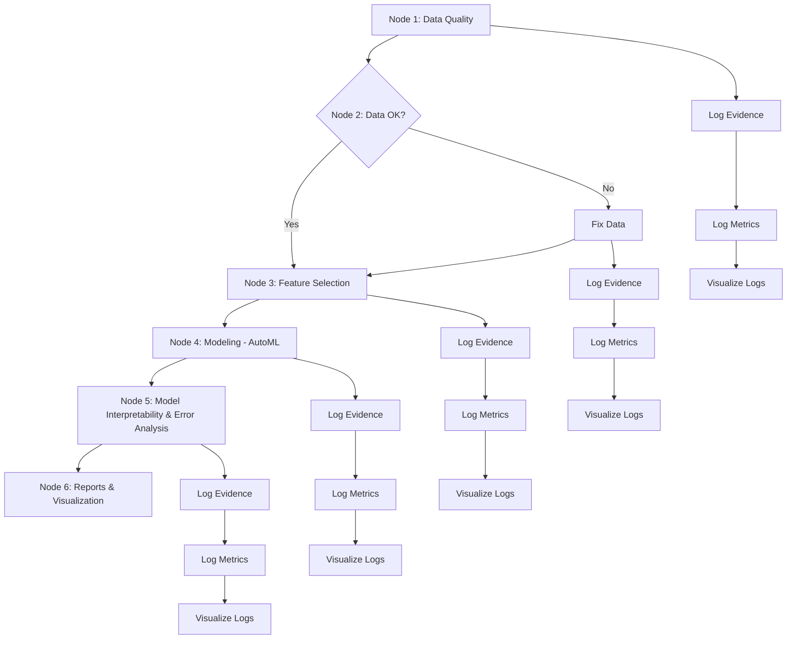

# AutoML Assignment: Kaggle Dataset Analysis

## Overview

This project involves analyzing a Kaggle dataset to predict daily bike rental counts using various environmental and temporal factors. The analysis leverages **H2O's AutoML** to explore different machine learning models, with an emphasis on model interpretability using tools such as **SHAP** and **LIME**. Key influencing factors such as temperature and year are identified, providing valuable insights into rental patterns. The study aims to balance model complexity with predictive accuracy.


## Business Question

The main objective is to accurately predict daily bike rental counts based on environmental and seasonal factors. Key questions include:

- **Prediction:** How can we forecast future bike rental demand using historical data?
- **Influencing Factors:** How do variables like weather conditions, seasonality, and temporal aspects correlate with rental frequency?
- **Event Detection:** Are there specific events (e.g., holidays, extreme weather) that influence the rental patterns significantly?

## Project Workflow

The project consists of multiple nodes that encompass the complete machine learning pipeline, from data quality checks to model analysis. Below is a visual flowchart that outlines the process.

### Flowchart of the AutoML Pipeline



## Key Steps and Findings

### 1. Data Preparation

- **Data Quality Assessment**: Initial checks were conducted to ensure the completeness of the dataset. Any issues found were corrected.
- **Feature Engineering**: Categorical variables were encoded using one-hot encoding, and normalized numerical features were used as-is.
- **Train-Test Split**: The data was split into an 80-20 train-test set to validate model performance.

### 2. Model Building

- **Models Used**:
  - **Linear Regression**: Achieved an R² of **0.84**.
  - **Random Forest Regressor**: Outperformed linear regression with an R² of **0.87**.
  - **AutoML Models**: Evaluated models like Random Forest, XGBoost, and GLM using H2O’s AutoML. The AutoML model achieved an **R² of 0.89** for some models but ensemble models were excluded for simplicity.

### 3. Model Evaluation

- **Performance Metrics**:
  - Linear Regression: Mean Absolute Error (MAE) **583**.
  - Random Forest: MAE **471**, demonstrating improved accuracy.
  - AutoML Models: Achieved the highest accuracy with **MAE of 462**.
- **SHAP & LIME**: Both tools were utilized for model interpretability. The year (`yr`) and temperature (`temp`) were key features driving predictions.

### 4. Insights

- **Temperature and Year** were found to be the most impactful features in predicting bike rentals.
- The **AutoML** approach allowed for efficient model exploration, balancing model complexity and interpretability.
- Models were tested under different conditions to verify their generalizability to unseen data.

### 5. Interpretability Challenges

- The use of **ensemble models** posed challenges for interpretability due to their complexity. Therefore, these were excluded from detailed interpretability analysis to simplify SHAP analysis.
- Individual models provided straightforward insights into which features had the most significant impact on predictions.

## Conclusion

- **AutoML** helped efficiently identify the best models for predicting bike rentals.
- **Random Forest** models showed better performance than linear models, and **SHAP** values provided detailed insights into the significance of individual features.
- Simpler models were prioritized for interpretability, though **AutoML** found that some complexity was beneficial for accuracy.

## How to Use

1. Clone the repository:
   ```bash
   git clone https://github.com/your-username/Your-Repo-Name.git
   ```
2. Install dependencies:
   ```bash
   pip install h2o shap matplotlib seaborn
   ```
3. Run the analysis:
   ```python
   # Load dataset, perform feature engineering, and run AutoML analysis as per the notebook script.
   ```

## License

MIT License. For full details, please refer to the `LICENSE` file in this repository.

## References

- H2O.ai for AutoML framework
- SHAP for interpretability
- Kaggle dataset for data sources

---

This project aims to showcase how **AutoML** can streamline predictive modeling while maintaining model interpretability. Feel free to contribute or reach out for further information!

